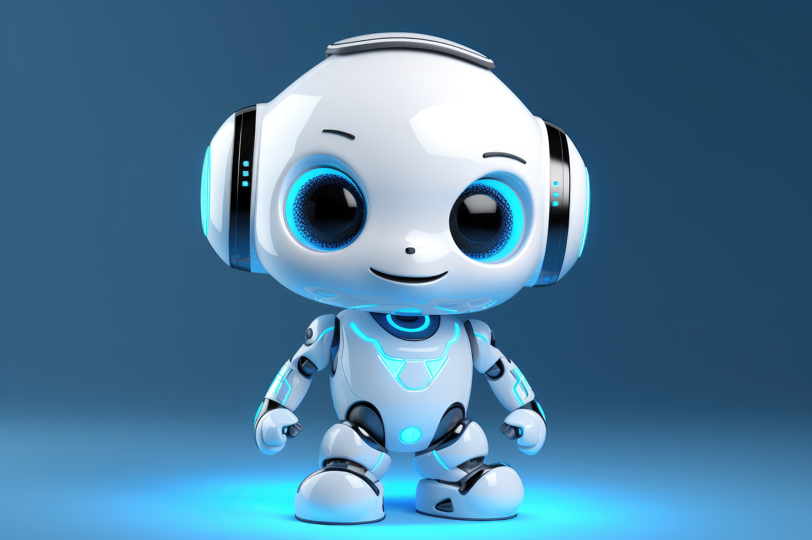

# UniVerse

  

A toolkit for collecting, processing, and exploring university data, developed by Rim Chehade and Karen Timiani.

---

## Features

- Compare Lebanese universities (LU, LAU, LIU)
- Ask questions via text or voice (Whisper-enabled)
- Retrieve accurate answers using Agentic RAG
- Export conversations (PDF format)
- Lightweight frontend (HTML/CSS/JS) connected to a Flask backend

---

## Stack

- **Backend:** Flask (Python)
- **Frontend:** HTML, CSS, JavaScript
- **Deployment:** Kaggle + ngrok
- **Model:** meta-llama/Llama-2-7b-chat-hf + FAISS + BAAI/bge-large-en-v1.5
- **Voice:** OpenAI Whisper for speech-to-text

---

## Code & Hosting

The main codebase and backend are hosted on Kaggle. This GitHub repo will serve as the front-facing project, pulling in core notebooks and scripts as needed.

- **Kaggle notebooks:** [https://www.kaggle.com/karentimani/agenitic-rag](https://www.kaggle.com/karentimani/agenitic-rag)
- **Live backend URL:** Uses an ngrok tunnel provided in the Kaggle notebook (update the `ngrok_url` in your frontend code when it changes)

To integrate:

1. Open the Kaggle notebook and click **Copy & Edit** to clone into your Kaggle account.
2.  Run all cells to start the Flask server, then copy the ngrok URL shown in the output (e.g., https://xxxx.ngrok-free.app).
3. Paste the URL into **script.js** by replacing the existing backend URL.
4. Open **index.html** in your browser to start using the chatbot.
